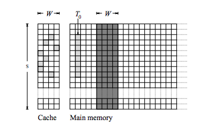

论文 [Cache Attacks and Countermeasures: the Case of AES](https://pdfs.semanticscholar.org/4d62/4b942a58818f8d425460638cb4b65ed84e1c.pdf)

## 缓存结构

Modern processors use one or more levels of set-associative memory cache. Such a cache consists
of S cache sets, each containing A cache lines
, where each cache line holds B bytes (the cache
line size). Overall, the cache contains S · W · B bytes, but the mapping of memory addresses into
the cache is limited as follows. 

First, the cache holds copies of aligned blocks of B bytes in main
memory, which we will term memory blocks; when a cache miss occurs, a full memory block is
copied into one of the cache lines. 

Second, each memory block may be cached only in a specific
cache set; specifically, the memory block starting at address a can be cached only in the W cache
lines belonging to cache set ⌊a/B⌋ mod S. See Figure 1. Thus, the memory blocks are partitioned
into S classes, where the blocks in each class contend for the cache lines in a single cache set.



图中有s个set，W=A=4，4路组相联，每个小格子空间为B-byte。

## 128-AES加密架构


##  Evict+Time


a) Trigger an encryption of p.

(b) (evict) Access some W memory addresses, at least B bytes apart, that are congruent to
V (Tℓ) + y · B/δ modulo S · B.

(c) (time) Trigger a second encryption of p and time it. This is the measurement score.14

利用cache-miss的的时间差，判断(b)中是否正确覆盖了特定的内存地址。如果特定的y使得总是能够cache-miss，那么，y的选取成功覆盖了特定的缓存，表示y为正确的数。

## Prime+Probe

The attacker allocates a contiguous byte array A[0, . . . , S ·W ·B −1],
with start address congruent modS · B to the start address of T0.

(a) (prime) Read a value from every memory block in A( to full the whole cache).

(b) Trigger an encryption of p.

(c) (probe) For every table l = 0, . . . 3 and index y = 0, δ, 2δ, . . . , 256 − δ:
• Read the W memory addresses A[1024ℓ + 4y + tSB] for t = 0, . . . , W − 1. The total time
it takes to perform these reads is the measurement score, i.e., our sample of Mk(p, ℓ, y).

通过测量时间，可以得知(a)中覆盖的缓存，哪些在(c)中cache-miss了，从而得知(b)中用到了哪些内存地址。

## 判断CPU类型

[https://en.wikipedia.org/wiki/CPUID](https://en.wikipedia.org/wiki/CPUID)

```
#include <stdint.h>
#include <stdlib.h>
#include <string.h>
#include <stdio.h>

const char *cpuid_get_vendor()
{
    uint32_t regs[3];
    static char buffer[13];
    static char *vendor;

    asm volatile(
                 "cpuid" :
                 "=b" (regs[0]), "=c" (regs[2]), "=d" (regs[1]) :
                 "a" (0));

    vendor = buffer;
    memcpy(vendor, regs, 12);

    return vendor;
}

int main(int argc, const char *argv[]) {
    printf("%s\n", cpuid_get_vendor());
    // GenuineIntel
}
```


